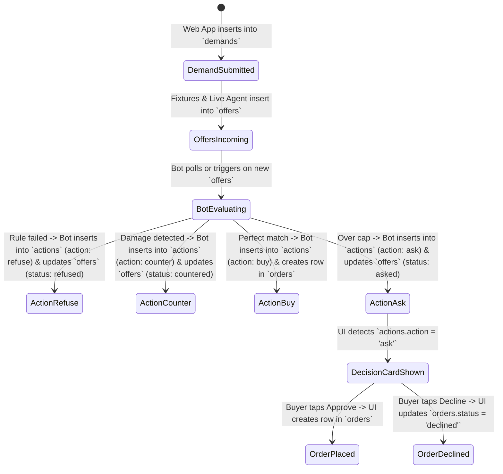

# Shared Contract: Counter Hackathon Architecture

This document defines the strict contract between **Hacker 1 (Frontend & Presentation)** and **Hacker 2 (AI, Backend & Data)**.

Neither hacker should deviate from these table schemas, status enums, or tool shapes during the hackathon.

---

## 1. Database Schema (Supabase)

### Table: `shops`
Stores the seeded reseller shop information.
```sql
create table shops (
  id uuid primary key default gen_random_uuid(),
  name text not null,               -- e.g. 'Vintage Threads London'
  channel text not null default 'Depop',
  currency text not null default 'GBP',
  created_at timestamp with time zone default now()
);
```

### Table: `shop_history`
Past sales data used to justify the mandate.
```sql
create table shop_history (
  id uuid primary key default gen_random_uuid(),
  shop_id uuid references shops(id),
  category text not null,            -- e.g. 'Levi''s 501'
  size text not null,                -- e.g. 'W30 L32'
  grade text not null,               -- e.g. 'A'
  sold_price numeric not null,       -- e.g. 45.00
  days_to_sell int not null,         -- e.g. 6
  outcome text not null check (outcome in ('sold', 'returned', 'unsold'))
);
```

### Table: `mandates`
Standing buyer rules in structured fields and 4 human-readable sentences.
```sql
create table mandates (
  id uuid primary key default gen_random_uuid(),
  shop_id uuid references shops(id),
  max_landed_price numeric not null default 18.00,
  min_waist int not null default 28,
  max_waist int not null default 32,
  not_as_described_limit int not null default 2,
  ask_conditions jsonb not null default '["grade_mismatch", "price_over_cap"]'::jsonb,
  rules_sentences jsonb not null,    -- array of 4 plain sentences
  created_at timestamp with time zone default now()
);
```
**Default `rules_sentences`:**
1. *"Landed price at or under £18 per piece."*
2. *"Waist sizes 28-32 only. Those sizes sell in this shop."*
3. *"Refuse a supplier whose recent orders were not as described twice."*
4. *"Ask the buyer when the photo grade disagrees with the claimed grade, or when the price breaks £18. Otherwise buy."*

---

### Table: `demands`
Created when the reseller types their demand prompt into the web app.
```sql
create table demands (
  id uuid primary key default gen_random_uuid(),
  shop_id uuid references shops(id),
  raw_message text not null,
  quantity int not null,             -- e.g. 40
  category text not null,            -- e.g. 'Levi''s 501'
  grade text not null,               -- e.g. 'Grade A'
  sizes text not null,               -- e.g. '28-32'
  max_unit_price numeric not null,   -- e.g. 18.00
  budget numeric not null,           -- e.g. 600.00
  status text not null default 'open' check (status in ('open', 'processing', 'completed')),
  created_at timestamp with time zone default now()
);
```

---

### Table: `suppliers`
Wholesale supplier metadata and trust record.
```sql
create table suppliers (
  id uuid primary key default gen_random_uuid(),
  name text not null,
  not_as_described_count int not null default 0,
  typical_ship_days int not null default 7,
  is_live boolean not null default false,
  created_at timestamp with time zone default now()
);
```

---

### Table: `offers`
The core exchange surface. Suppliers write rows here; Buyer Bot evaluates them.
```sql
create table offers (
  id uuid primary key default gen_random_uuid(),
  demand_id uuid references demands(id),
  supplier_id uuid references suppliers(id),
  claimed_grade text not null,       -- e.g. 'A'
  seen_grade text,                   -- e.g. 'B' (populated by bot inspection)
  seen_grade_reason text,            -- e.g. '3 frayed hems detected'
  damage_markers jsonb,              -- array of coordinates: [{ x: 120, y: 85, radius: 24, label: "Frayed hem" }]
  unit_price numeric not null,       -- e.g. 16.00
  shipping numeric not null,         -- e.g. 2.00
  ship_days int not null,            -- e.g. 21
  quantity int not null,             -- e.g. 20
  photo_urls text[] not null,        -- array of image URLs
  status text not null default 'open' check (status in ('open', 'countered', 'accepted', 'refused', 'asked')),
  created_at timestamp with time zone default now()
);
```

---

### Table: `actions`
The audit trail (Ledger). Every evaluation step generates an action row.
```sql
create table actions (
  id uuid primary key default gen_random_uuid(),
  offer_id uuid references offers(id),
  action text not null check (action in ('buy', 'counter', 'refuse', 'ask')),
  rule_cited text not null,          -- e.g. 'Supplier unreliable (2 not-as-described)'
  note text not null,                -- e.g. 'Refused. Two not-as-described orders.'
  created_at timestamp with time zone default now()
);
```

---

### Table: `orders`
Created autonomously by the bot on `buy`, or by the Web UI when the buyer taps **Approve**.
```sql
create table orders (
  id uuid primary key default gen_random_uuid(),
  offer_id uuid references offers(id),
  quantity int not null,
  unit_price numeric not null,
  shipping numeric not null,
  total numeric not null,
  status text not null default 'placed' check (status in ('placed', 'declined')),
  shopify_draft_id text,             -- optional stretch
  created_at timestamp with time zone default now()
);
```

---

## 2. The 4 Demo Scenarios (Fixtures & Figures)

The live presentation script uses these fixed numbers so the ledger totals add up on stage:

| Supplier | Description | Price / Shipping | Grade | Issues / Conditions | Outcome |
| :--- | :--- | :--- | :--- | :--- | :--- |
| **Supplier A** | Cheapest Wholesaler | £12 / £4 (Landed £16) | Claimed A | Ship window 28 days; **2 not-as-described orders** in record | **Refuse**<br>Rule cited: *Refuse supplier with 2 not-as-described orders* |
| **Supplier C** | Standard Vintage Co. | £16 / £2 (Landed £18) | Claimed A | Bot detects 3 frayed hems on photo. Seen grade: **B** | **Counteroffer at £14**<br>Supplier C accepts counter! |
| **Supplier D** (Live) | Euro Vintage Hub | £15 / £2 (Landed £17) | Claimed A | Photo confirmed Grade A, waist sizes 28–32, 5 days ship | **Autonomous Buy**<br>Order placed with 0 clicks |
| **Supplier B** (2nd Lot) | Premium Denim Lot | £18 / £2 (Landed £20) | Claimed A | Perfect condition, but **£2 over the £18 landed cap** | **Ask (Decision Card)**<br>Buyer taps `[Approve]`. Order placed |

### Final Receipt Math:
* **Pieces Bought**: 20 pcs (Supplier D) + 20 pcs (Supplier B) = **40 pcs**
* **Total Spend**: £340 (Supplier D) + £400 (Supplier B) = **£740**
* **Offers Refused**: 1 (Supplier A)
* **Counters Accepted**: 1 (Supplier C)
* **Risk Avoided / Money Saved**: Avoided bad lot from Supplier A (£320 saved from defective stock), negotiated £40 discount with Supplier C.

---

## 3. Communication Contract (Events & Actions)


