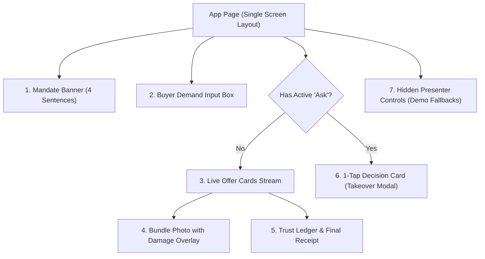

# Hacker 1 Implementation Plan: Frontend & Demo UX

**Owner**: Hacker 1 (Frontend & Presentation Specialist)  
**Mission**: Deliver the single-screen web interface that the judges and room will watch during the 3-minute pitch. The screen must be readable from the back of the room (large type, bold status chips, high contrast, marked damage photos) and react instantaneously to database changes.

**Reference Contract**: [CONTRACT.md](file:///Users/prakashverma/src/shopping-bot/CONTRACT.md)

---

## 1. Tech Stack & Setup
* **Framework**: React / Next.js (App Router or Pages Router) or Vite + React
* **Styling**: Tailwind CSS + `lucide-react` icons
* **Data Layer**: `@supabase/supabase-js` (Realtime channel subscriptions)
* **Image Annotations**: Custom CSS / SVG overlay or HTML Canvas for defect markers

---

## 2. Component Architecture



---

## 3. Step-by-Step Implementation Checklist

### Step 1: Scaffold App & Connect to Supabase (~30 mins)
- [ ] Initialize React/Next project with Tailwind CSS.
- [ ] Install `@supabase/supabase-js` and configure Supabase client with project URL & Anon Key.
- [ ] Verify realtime listening by setting up subscription to `offers`, `actions`, and `orders` tables.
- [ ] Test with mock row insert from Hacker 2.

### Step 2: Mandate Banner & Buyer Input Bar (~45 mins)
- [ ] **Mandate Bar**: Display the 4 standing rules prominently at the top in simple English:
  1. *Landed price at or under £18 per piece.*
  2. *Waist sizes 28-32 only. Those sizes sell in this shop.*
  3. *Refuse a supplier whose recent orders were not as described twice.*
  4. *Ask the buyer when the photo grade disagrees with the claimed grade, or when the price breaks £18. Otherwise buy.*
- [ ] **Demand Input**: Single input box pre-filled with the demo script prompt:
  > *"I need about 40 Grade A Levi's 501s, waist 28-32, under £18 landed, the kind that sells in my shop. Budget £600. Only ping me if the grade looks wrong or the price breaks the cap."*
- [ ] On click "Send Demand", insert row into `demands` table in Supabase.

### Step 3: Realtime Offers Stream (~45 mins)
- [ ] Create `OfferCard` component displaying:
  * Supplier name & trust indicator (e.g., `2 not-as-described orders`).
  * Price & shipping breakdown: `£15/pc + £2 ship = £17 landed`.
  * Claimed Grade badge vs. Seen Grade badge.
  * Big status badge dynamically driven by `actions` table (`Refused`, `Countering...`, `Bought Autonomously`, `Action Required`).
- [ ] Animate new cards smoothly as they arrive from `offers` table via Realtime.

### Step 4: Marked Photo Inspection Component (~45 mins)
- [ ] On the offer card where `seen_grade != claimed_grade` (Supplier C):
  * Render the bundle image.
  * Overlay SVG red circles / bounding boxes based on `damage_markers` JSON:
    ```json
    [{ "x": 120, "y": 85, "radius": 24, "label": "Frayed hem" }]
    ```
  * Display the bot's concise dissent note: *"Claimed: Grade A. Seen: Grade B (3 frayed hems detected)"*.

### Step 5: The 1-Tap Decision Card (~45 mins)
- [ ] When an action with `action = 'ask'` is received, present the **Decision Card** takeover:
  * Headline: **Decision Required: Price exceeds mandate cap by £2**
  * Comparison Table:
    * Landed Price: **£20** (Cap: £18)
    * Grade: **Grade A Confirmed**
    * Quantity: **20 pcs**
    * Total: **£400**
  * Two massive buttons:
    * **[✓ Approve & Buy]** -> Inserts row into `orders` (status: `placed`) and closes card.
    * **[✕ Decline & Refuse]** -> Inserts row into `orders` (status: `declined`) and closes card.
- [ ] Transitions cleanly back to the main view after the tap.

### Step 6: Trust Ledger & Final Receipt (~45 mins)
- [ ] Create the **Trust Ledger** view at the bottom/end of the thread:
  * Chronological list of every action taken and the exact rule cited:
    1. *Refused Supplier A*: Slow ship window + 2 not-as-described orders.
    2. *Countered Supplier C*: Detected 3 damaged hems, offered £14 (Accepted).
    3. *Bought Supplier D*: All rules satisfied (£17 landed).
    4. *Approved Supplier B*: 1-tap buyer approval for £20 lot.
- [ ] Create the **Closing Receipt Card**:
  * Total Pieces Purchased: **40 pcs**
  * Total Spend: **£740**
  * Refusals / Bad Stock Avoided: **£320 saved**
  * Counteroffer Savings: **£40 negotiated**
  * Banner: *"0 store checkouts opened. Fully audited."*

### Step 7: Presenter Controls / Emergency Fallbacks (~30 mins)
- [ ] Build a discreet, hidden drawer (toggle via keyboard shortcut `Shift + D` or discreet button):
  * **[Simulate Supplier A Arrival]**
  * **[Simulate Supplier C Arrival & Counter]**
  * **[Simulate Supplier D Autonomous Buy]**
  * **[Trigger Decision Card (Supplier B)]**
  * **[Reset Demo State]** (Clears `demands`, `offers`, `actions`, `orders`)
- [ ] Ensures that even if the venue Wi-Fi stutters or the live agent stalls, the presenter can advance the demo seamlessly on stage.

---

## 4. Acceptance Criteria
1. **Readable from 10 feet away**: High contrast fonts, clear action chips.
2. **Zero Polling**: UI automatically refreshes via Supabase Realtime listeners.
3. **No Business Logic in Frontend**: UI acts strictly as a visual mirror of the Supabase tables.
4. **Seamless Decision Card**: Tapping "Approve" immediately closes the card and posts the order to Supabase.
