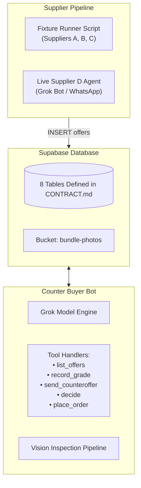

# Hacker 2 Implementation Plan: AI, Agent Logic & Backend

**Owner**: Hacker 2 (AI, Agent Logic & Backend Specialist)  
**Mission**: Build the database schema, seed historical context, configure the Grok Buyer Bot tools, implement image inspection, and orchestrate the supplier agents (3 fixtures + 1 live).

**Reference Contract**: [CONTRACT.md](file:///Users/prakashverma/src/shopping-bot/CONTRACT.md)

---

## 1. Tech Stack & Setup
* **Database**: Supabase (PostgreSQL + Realtime enabled)
* **Agent Framework**: Node.js / TypeScript or Python running Grok Bot (xAI API / OpenAI compatible client)
* **Vision Model**: Multimodal Vision API (Grok Vision or OpenAI GPT-4o / Gemini Flash)
* **Storage**: Supabase Storage for bundle test images

---

## 2. Component Architecture



---

## 3. Step-by-Step Implementation Checklist

### Step 1: Database Provisioning & Seed Data (~45 mins)
- [ ] Execute the SQL migrations defined in [CONTRACT.md](file:///Users/prakashverma/src/shopping-bot/CONTRACT.md):
  * Create tables: `shops`, `shop_history`, `mandates`, `demands`, `suppliers`, `offers`, `actions`, `orders`.
  * Enable **Realtime** on `demands`, `offers`, `actions`, and `orders`.
- [ ] Create Supabase Storage bucket `bundle-photos` and upload test fixture photos:
  * Photo 1: Clean Levi's 501 bundle (Grade A).
  * Photo 2: Damaged Levi's 501 bundle with visible fraying/stains for Supplier C.
- [ ] Seed base data:
  * `shops`: 1 row (`Vintage Threads London`, `Depop`).
  * `shop_history`: 15 rows of past sales showing waist sizes 28–32 sell fast, while size 36+ sat unsold.
  * `mandates`: 1 row with max landed price £18, waist 28–32, not-as-described limit 2, and the 4 plain sentences.
  * `suppliers`: 4 rows (Supplier A, B, C, and Live Supplier D).

### Step 2: Supplier Simulation Runner (~45 mins)
- [ ] Create a Node/Python runner script `simulate_suppliers.ts` to insert fixture offers with realistic timing:
  * **T+10s**: Insert **Supplier A** offer (£12 unit + £4 shipping, 28 days ship, 20 pcs, claimed Grade A).
  * **T+20s**: Insert **Supplier C** offer (£16 unit + £2 shipping, 7 days ship, 20 pcs, claimed Grade A, points to damaged bundle photo).
  * **T+30s**: Insert **Supplier D** offer (£15 unit + £2 shipping, 5 days ship, 20 pcs, claimed Grade A, clean photo).
  * **T+45s**: Insert **Supplier B** offer (£18 unit + £2 shipping, 5 days ship, 20 pcs, claimed Grade A, £2 over cap).

### Step 3: Photo Inspection & Vision Pipeline (~45 mins)
- [ ] Build `inspect_photos(imageUrl, claimedGrade)`:
  * Prompts vision model to inspect clothing bundle images for tears, stains, frayed cuffs, and zipper damage.
  * Target output format:
    ```json
    {
      "seen_grade": "B",
      "reason": "3 frayed hems detected on front row jeans",
      "markers": [
        { "x": 120, "y": 85, "radius": 24, "label": "Frayed hem" },
        { "x": 240, "y": 140, "radius": 20, "label": "Tear near pocket" },
        { "x": 310, "y": 195, "radius": 22, "label": "Frayed cuff" }
      ]
    }
    ```
- [ ] For demo safety: Pin exact coordinates as a reliable fallback fixture for the designated Supplier C demo image so it never fails on stage.

### Step 4: Grok Buyer Bot & Tool Suite (~60 mins)
- [ ] Setup Grok agent with system prompt grounded on the standing Mandate.
- [ ] Implement and test the 6 required tools:
  1. `create_demand(raw_message)`: Parses text into structured fields (qty, category, grade, sizes, max_unit_price, budget) and saves to `demands`.
  2. `list_offers(demand_id)`: Fetches incoming offers joined with supplier reputation data.
  3. `record_grade(offer_id, seen_grade, reason, markers)`: Updates `offers` with inspected grade and damage annotations.
  4. `send_counteroffer(offer_id, new_unit_price, note)`: Updates `offers.status = 'countered'` and logs action in `actions`.
  5. `decide(offer_id, action, rule_cited, note)`: Evaluates rules and logs decision in `actions` table (`buy`, `counter`, `refuse`, `ask`).
  6. `place_order(offer_id)`: Inserts placed order into `orders` table.

### Step 5: Live Supplier Agent (Supplier D) (~30 mins)
- [ ] Setup a lightweight listener for new `demands` rows.
- [ ] When a demand is created, generate a live response from Supplier D:
  * Uses Grok Bot or Wassist WhatsApp webhook.
  * Inserts the live offer row into `offers` with realistic unit price (£15) and delivery window (5 days).

### Step 6 (Stretch Goal): Shopify Dev Store Integration (~30 mins)
- [ ] In `place_order`, call the Shopify Admin REST/GraphQL API to generate a draft product in a dev store:
  * Title: *"Vintage Levi's 501s Bundle (20 pcs)"*
  * Price: Total order value.
  * Image: Bundle photo.
- [ ] Record `shopify_draft_id` on the `orders` row. *(Optional: failure must not block the demo).*

---

## 4. Acceptance Criteria
1. **Schema Integrity**: All 8 tables deployed with correct constraints and foreign keys.
2. **Tool Execution**: Grok bot successfully reads an offer, cites the mandate rule, and writes the decision to `actions`.
3. **Reproducible Script**: Running `npm run demo:seed` completely resets the state and executes the 4 supplier steps predictably.
4. **Vision Reliability**: Defect coordinates reliably render on the damaged photo.
